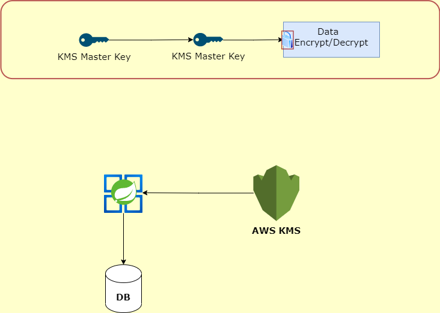

# springboot-aws-ale-encryption

A sample app to encrypt/decrypt data before storing into database using AWS kms. 
AWS KMS uses [envelop encryption](https://docs.aws.amazon.com/kms/latest/developerguide/concepts.html#enveloping).


## Step 1 : Generating  KMS keys

Generate data key using below command. Refer [AWS documentation](https://docs.aws.amazon.com/cli/latest/reference/kms/generate-data-key.html) for more details.

```bash
aws kms generate-data-key \
    --key-id alias/MasterKeyAlias \
    --key-spec AES_256
```


## Step 2 : Encryption/Decryption

- Store the data in secure place, recommended to use AWS Secrets Manager. You can not decrypt the data if data key once lost.
- AESEncryptor class is responsible encrypting and decrypting the data using data-key

## References
https://docs.aws.amazon.com/cli/latest/reference/kms/generate-data-key.html
https://docs.aws.amazon.com/kms/latest/developerguide/concepts.html#enveloping